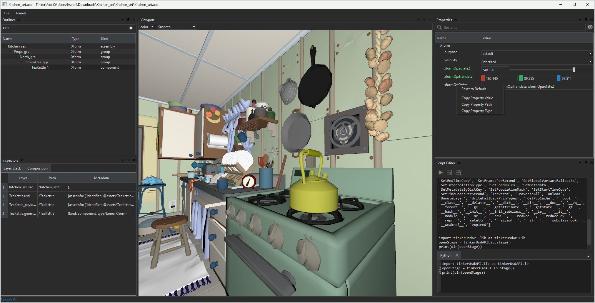

# TinkerUsd
TinkerUsd is an experimental project written in C++ for R&D purposes. This project is free and very much work in progress.



# Features
- [Property Editor](source/ui/propertyEditor/README.md)
- Integrated Python Script Editor
- API Python bindings using Pixar's boost
- Hydra OpenGL Rendering with Viewport ( sRGB support )
- Perspective Camera System (dolly, pan, zoom)
- Composition Inspector
- Outliner
- Basic Selection

## How to Build

This project currently is supported on **Windows** only at the moment. I just haven't had time to get this on Linux or MacOs.

#### Requirements

- [OpenUSD 24.11 or above](https://github.com/PixarAnimationStudios/OpenUSD)
- [Advanced Docking System (ADS)](https://github.com/githubuser0xFFFF/Qt-Advanced-Docking-System)
- [Qt 6](https://www.qt.io/product/qt6)
- [CMake](https://cmake.org)
- [C++20 compiler](https://en.cppreference.com/w/cpp/compiler_support/20)

#### 1. Setup build_settings.json
You need to set the paths to `qt_location`, `pxrusd_location`, `build_location`, `install_location`.
Choose either **Ninja** or **Visual Studio 17 2022** for the cmake genrator.

e.g
```
{
  "build_args": 
  {
  },

  "cmake_generator": "Visual Studio 17 2022", 
  "qt_location": "D:/qt/6.5.3",
  "pxrusd_location": "D:/OpenUSD/Install/Release",
  "build_location": "D:/TinkerUsd/Build/Release",
  "install_location": "D:/TinkerUsd/Install/Release"
}
```

#### 1. build.py Script 

```
build.py --stages=clean,configure,build,install
```

This is how the install directory will look like after the build/install stages finish.

```
> tree /F 

D:\TinkerUsd\Install\Release
├───lib
│   │   tinkerUsdAPI.dll
│   │   tinkerUsdAPI.lib
│   │
│   └───python
│       └───tinkerUsdAPI
│           │   __init__.py
│           │
│           └───lib
│                   _tinkerUsdAPI.lib
│                   _tinkerUsdAPI.pyd
│                   __init__.py
│
└───TinkerUsd
        TinkerUsd.exe
        TinkerUsd.pdb
```

##### Running Executable

Before running the executable, both **PYTHONPATH** and **PXR_USD_WINDOWS_DLL_PATH** must be set:

```
set PXR_USD_WINDOWS_DLL_PATH=%PXR_USD_WINDOWS_DLL_PATH%;<install_location>\lib
set PYTHONPATH=%PYTHONPATH%;<install_location>\lib\python
```


