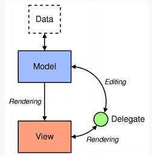

PropertyEditor Overview
==================================
PropertyEditor strictly follows Qt's model-view-delegate (MVD) pattern.

- `PropertyDelegate`: This class is used to display and edit data items from a model.
- `PropertyModel`: This class implements the Qt data model for the property tree view.
- `PropertyTreeView`: This class implements the Qt TreeView for property editor.

Supported USD Types
=====================
List of supported types for editing as of today:

- bool
- int32_t
- uint32_t
- float
- double
- std::string
- TfToken
- GfVec2d
- GfVec3d
- GfVec4d
- GfVec2f
- GfVec3f
- GfVec4f
- Color3f
- Color4f
- GfMatrix2d
- GfMatrix3d
- GfMatrix4d
- SdfAssetPath
- VtArray<bool>
- VtArray<int32_t>
- VtArray<uint32_t>
- VtArray<float>
- VtArray<double>
- VtArray<std::string>
- VtArray<PXR_NS::GfVec2f>
- VtArray<PXR_NS::GfVec2d>
- VtArray<PXR_NS::GfVec3f>
- VtArray<PXR_NS::GfVec3d>
- VtArray<PXR_NS::TfToken>

How to Create and Register a New Editor
========================================
All the editors must derive from the `AbstractPropertyEditor` abstract class. 

**Step 1- Define the Editor Widget Class:**

Create a widget class that provides the editor interface. This class should handle the user interactions for editing the property value and must provide a `void commitData()` signal.

**Step 2- Define the Editor Class:**

Create a class that derives from AbstractPropertyEditor. This class must implement the virtual functions createEditor, setEditorData, and editorData.

**Step 3- Register your New Editor with the Factory**

Modify the `createNewAttributeEditor` function to include the new editor.